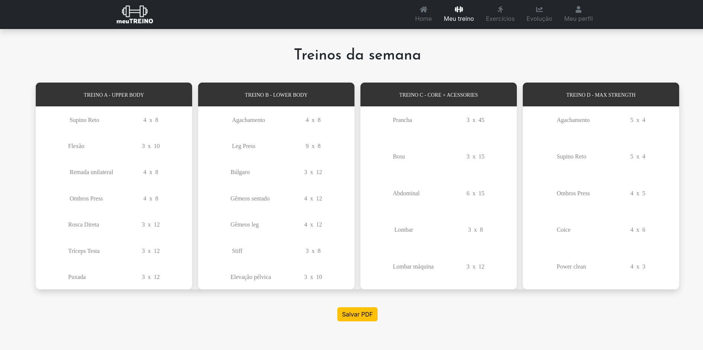
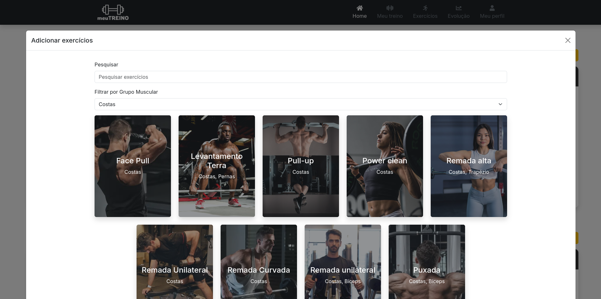

> **Aviso:** Projeto em desenvolvimento.


# meuTREINO

**meuTREINO** é uma plataforma interativa onde os usuários podem montar e personalizar seus próprios treinos de acordo com suas necessidades e objetivos. O site também permite acompanhar métricas como repetições, séries, e cargas utilizadas ao longo dos treinos, facilitando o monitoramento de progresso e a adaptação dos exercícios.

## Treino semanal





## Funcionalidades

- **Montar Treinos Personalizados**: O usuário pode criar e organizar seus treinos, escolhendo exercícios específicos e definindo o número de repetições, séries e cargas.
- **Visualização de Métricas**: A plataforma exibe dados detalhados de cada treino, permitindo ao usuário acompanhar seu progresso.
- **Treinos Salvos**: O usuário pode salvar seus treinos para reutilizar em sessões futuras, facilitando a estruturação contínua dos treinos.
- **Fácil Acompanhamento**: Visualize seus treinos de forma clara e objetiva, com uma tabela interativa que mostra todos os exercícios de cada treino da semana.
- **Interface Responsiva**: O site é totalmente responsivo e adaptado para visualização em dispositivos móveis e desktop.

## Tecnologias Utilizadas

- **Frontend**:  
  - **Vue.js** (para construção da interface interativa)
  - **Bootstrap** (para estilização rápida e responsiva)
  - **Axios** (para requisições HTTP)
- **Backend**:
  - **Node.js** com **Express** (para servidor e API RESTful)
  - **PostgreSQL** (para armazenar os dados dos treinos e dos exercícios)
  
## Como Funciona

### Montando seu Treino
1. **Criação de Treino**: Ao acessar a plataforma, o usuário pode criar um novo treino, adicionar exercícios e definir as repetições e as séries. O usuário tem liberdade para organizar o treino como desejar.
   
2. **Acompanhamento de Métricas**: Durante e após os treinos, o usuário pode ver as métricas de cada exercício, incluindo o peso utilizado.

3. **Salvamento de Treinos**: O usuário pode salvar o treino criado e usá-lo em futuras sessões, o que facilita a continuidade e o progresso dos treinos.

### Exemplo de Interface

A interface foi projetada para ser simples e intuitiva. Ela exibe os treinos e os exercícios em formato de tabela, com informações claras sobre cada exercício.

```plaintext
Treino A | Treino B
-------------------
Exercício 1 | Exercício 2
Sets: 3      | Sets: 4
Reps: 12     | Reps: 10
Peso: 20kg   | Peso: 25kg
